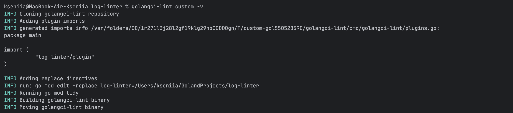
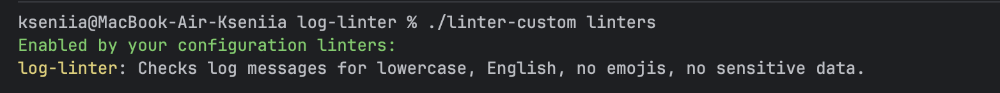
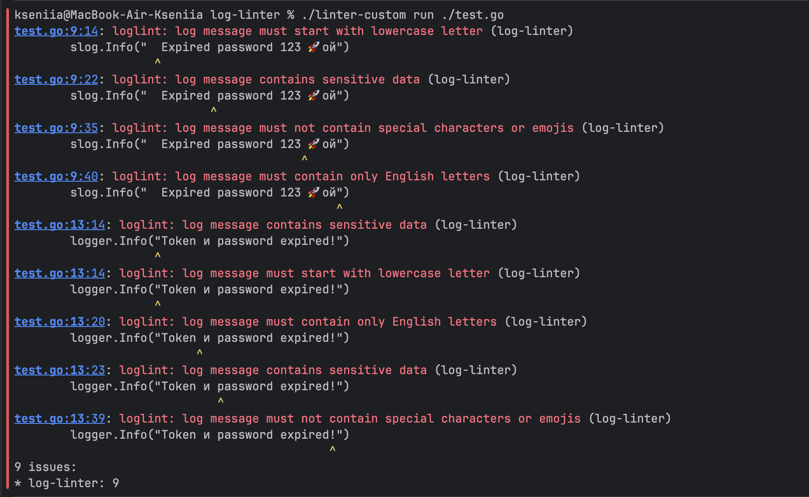

<div align="center">

# log-linter

**Линтер для Go, который автоматически проверяет логи на соответствие правилам оформления**

**Совместим с `golangci-lint`**

</div>

---

`loglint` автоматически проверяет текст сообщений на соответствие правилам для популярных библиотек логирования

##  Особенности

- **Производительность**: Использует стандартный фреймворк `go/analysis`
- **Гибкость**: Легко настраиваемые правила через конфигурационный файл
- **Масштабируемость**: Архитектура проекта спроектирована для легкого добавления новых правил
- **Интеграция**: Работает как самостоятельная утилита или как плагин для `golangci-lint`
- **Поддержка популярных логгеров**: поддерживает `zap.Logger`, `zap.SugaredLogger` и `log/slog`


##  Правила

| Название    | Описание                                                                                         |
|-------------|--------------------------------------------------------------------------------------------------|
| `lowercase` | Сообщение лога начинается со строчной буквы                                                      |
| `english`   | Набор букв ограничен английским алфавитом                                                        |
| `symbols`   | Запрещает использование спецсимволов и эмодзи в сообщении (кроме разрешенных)                    |
| `sensitive` | Запрещает использование чувствительных данных в сообщении по ключевым словам (кроме разрешенных) |

##  Конфигурация

Вы можете настроить правила через файл `.golangci.yml`. Пример конфигурации:

```yaml
version: "2"

issues:
  uniq-by-line: false
  max-same-issues: 0

linters:
  default: none
  enable:
    - log-linter
  settings:
    custom:
      log-linter:
        type: "module"
        description: "loglint reports suspicious or non-standard log messages"
        settings:
          rules:
            lowercase:
              enabled: true
            english:
              enabled: true
            symbols:
              enabled: true
              options:
                allowed: [".", "-", "_", "/", ":", "=", ",", "%"]
            sensitive:
              enabled: true
              options:
                patterns:
                  - "(?i)\\b(password|passwd|pwd)\\b"
                  - "(?i)\\b(api[_-]?key|apikey)\\b"
                  - "(?i)\\btoken\\b"
```

### Важные параметры

- `uniq-by-line: false` -- отключает группировку ошибок по строкам, чтобы показывать все найденные проблемы
- `max-same-issues: 0` -- убирает лимит на количество одинаковых диагностик

### Настройка правил

Каждое правило можно настроить:

| Параметр   | Описание                                       |
|------------|------------------------------------------------|
| `enabled`  | `true` — правило включено, `false` — выключено |
| `options`  | Дополнительные параметры для правила           |

#### Правило `symbols`

Позволяет задать список разрешенных символов:

```yaml
symbols:
  enabled: true
  options:
    allowed: [".", "-", "_", "/", ":", "=", ","]
```

#### Правило `sensitive`

Позволяет задать собственные паттерны для поиска:

```yaml
sensitive:
  enabled: true
  options:
    patterns:
      - "(?i)\\b(secret|private)\\b"
      - "(?i)\\b(admin|root)\\b"
```

Если собственные паттерны не указаны, используется дефолтный набор:

```
(?i)\b(password|passwd|pwd)\b
(?i)\b(api[_-]?key|apikey)\b
(?i)\btoken\b
```


## Интеграция с golangci-lint

```bash
# Собрать кастомный бинарник golangci-lint с плагином
golangci-lint custom -v

# Запустить проверку
./linter-custom run ./test.go
```
Сборка линтера:



Можем проверить что наш линтер добавился:



Пример работы линтера:



## Как самостоятельная утилита
```bash
#Проверим на каком-нибудь файлике
go run ./cmd/loglint -config config.yaml ./test.go
```
Пример работы:


можно без использования `-config config.yaml`, тогда будут использоваться настройки по умолчанию

## Запуск unit-тестов

```bash
go test -v ./...
```

##  Требования

- Go 1.22+
- Для работы в качестве плагина: `golangci-lint` версии 2.8.0+
